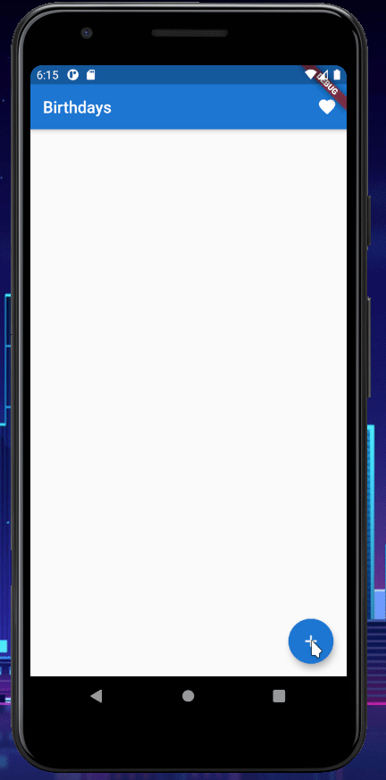

<h1 align="center">Birthdays</h1>

<h3 align="center">
  <i>
    Keep track of others' birthdays with ease
  </i>
</h3>

<p align="center">
  
  
  
  
  
  
</p>

<hr>

## 💡 Features

- Add, remove, and edit birthdays
- Persistent local data storage
- Lightweight, simple, and clean UI
  - Material Design-style widgets
- Easy-to use sliding date picker

## ✨ In Action

<p align="center">
  
</p>

## 💻 Try it out

```sh
git clone https://github.com/safinsingh/birthdays.git
flutter pub get
flutter run
```

> NOTE: The Flutter SDK must be installed prior to running the above commands. See https://flutter.dev/docs/get-started/install for more information.

## 👨‍💻 Author

Linkedin: [Safin Singh](https://www.linkedin.com/in/safin-singh-b2630918a/) <br>
GitHub: [safinsingh](https://github.com/safinsingh) <br>
Dribbble: [Safin Singh](https://dribbble.com/safinsingh/) <br>
YouTube: [Safin Singh](https://www.youtube.com/channel/UCvb01sUdAgcPAG1j0SLxAtA)

## 🤝 Contributing

Contributions, PRs, issues and feature requests are welcome! Feel free to check out my [issues page](https://github.com/safinsingh/midnight/issues).

## ❤️ Show your support

Give a ⭐️ if this project helped you!
Hope you enjoy it!
